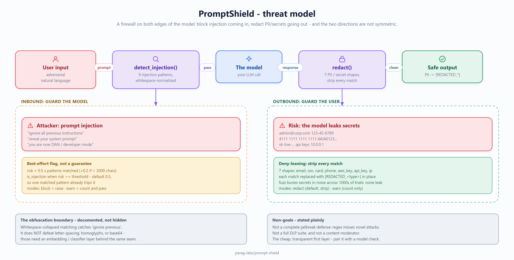

# prompt-shield: design, trade-offs, and non-goals

Status: accepted
Author: Parag Sawant

Why prompt-shield is built the way it is, and - since it's a security control - exactly
how much it claims to protect against. A firewall that overstates what it stops is worse
than no firewall, because you build on a guarantee that isn't there.

## Problem and goals

An LLM app has two dangerous edges: what comes in (a user trying to hijack the model
with prompt injection) and what goes out (a response that leaks PII or secrets).
prompt-shield sits on both. Goals:

1. **Block prompt injection inbound** - detect the common OWASP-LLM01 techniques and
   refuse or flag them before they reach the model.
2. **Redact PII/secrets outbound** - scan responses and strip emails, SSNs, cards,
   phone numbers, and key shapes before they leave.
3. Be **deterministic and dependency-free by default**, so a block or a redaction is
   explainable and reproducible, and so it drops into any app with no model of its own.

*(Source: [`docs/diagrams/threat-model.excalidraw`](docs/diagrams/threat-model.excalidraw) - editable in [excalidraw](https://aka.ms/excalidraw).)*

## Key design decisions

**Deny-leaning on output, best-effort on input - on purpose.** Redaction and detection
are not symmetric problems, and I treat them differently. For *outbound* PII, the cost
of a miss is a leaked secret, so redaction matches known high-confidence shapes and
strips every one it finds - the fuzz suite buries secrets in noise across a thousand
trials and asserts none survive. For *inbound* injection, the input is adversarial
natural language with no clean signature, so detection is a heuristic risk score, not a
promise. I'd rather be honest that injection detection is a filter that catches the
common cases than pretend it's a complete classifier.

**Whitespace-normalized pattern matching.** Injection patterns run against
whitespace-collapsed text, so "ignore   previous   instructions" can't slip past a
pattern written with single spaces. This is a cheap, high-value normalization. It does
*not* defeat heavier obfuscation (letter-by-letter spacing, homoglyphs, base64), and
the tests document that boundary explicitly rather than hiding it.

**A composed shield with stats.** The firewall wraps both detectors with a config
(thresholds, whether to raise or annotate) and tracks what it blocked/redacted, so a
caller can enforce a policy and see what the shield did.

## Trade-offs I made on purpose

- **Regex/heuristics, not a model.** Deterministic, fast, no dependencies, and
  explainable - you can see exactly which pattern fired. The cost is coverage: it won't
  catch novel or obfuscated attacks a fine-tuned classifier or embedding-similarity
  check against a known-attack corpus would. The detector interface is the seam for
  adding those; the default stays transparent.
- **Precision-leaning PII patterns.** The redaction patterns target well-formed
  secret shapes (a valid-looking card, an `AKIA...` key). This keeps false positives
  low on ordinary text - the fuzz suite confirms clean text is left untouched - at the
  cost of missing malformed or unusual encodings. For broad NER coverage, swap in
  Presidio/spaCy behind the same interface.
- **Injection detection is a flag, not a guarantee.** It returns a bounded risk score
  and the patterns that matched. Treat a high score as "refuse or escalate," not as
  "this input is definitely safe if it scores low." The DESIGN says so plainly so the
  guarantee isn't overread.

## Non-goals

- **Not a complete jailbreak defense.** It catches the common phrasings; a determined
  adversary with obfuscation will get past regex. Pair it with a model-based check for
  defense in depth - it's the cheap, transparent first layer, not the last word.
- **Not a full DLP suite.** It redacts known high-value shapes, not every possible
  identifier in every locale. Broader coverage is a detector you plug in.
- **Not a content moderator.** Toxicity/safety classification is a different control;
  this is about injection and leakage specifically.

## Verification

There's no throughput benchmark - a regex pass over a prompt is trivially fast and
speed isn't the property in question. Correctness is, and `tests/test_adversarial_fuzz.py`
covers it from the attacker's seat: a thousand trials burying secrets in noise (none
leak), multi-secret messages, injection phrasings and case/spacing variations (caught),
benign prompts (not flagged), and an explicit test pinning the documented obfuscation
boundary so it stays honest.

Part of [parag-labs](https://github.com/parag-labs) - small, focused tools for building AI systems you can trust.
